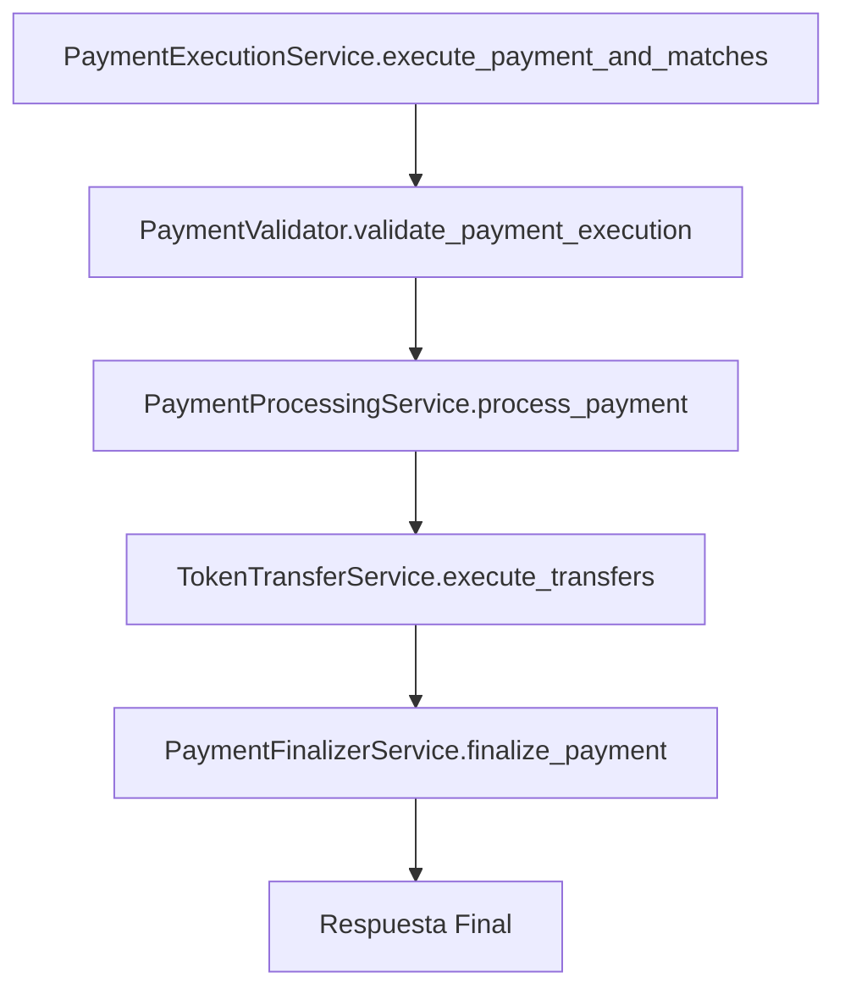

# Arquitectura de Servicios de Pago Refactorizada

## 📋 Resumen

La funcionalidad de ejecución de pagos ha sido refactorizada y dividida en **4 servicios especializados** más un **servicio orquestador**. Esto mejora significativamente la mantenibilidad, testabilidad y escalabilidad del código.

## 🏗️ Nueva Arquitectura

### **1. PaymentValidator** (`payment_validator.py`)
**Responsabilidad**: Todas las validaciones relacionadas con pagos
- ✅ Validar estados de órdenes
- ✅ Verificar expiración de selecciones
- ✅ Validar montos de pago
- ✅ Validar metadatos de selección

### **2. PaymentProcessingService** (`payment_processor.py`)
**Responsabilidad**: Solo procesamiento de pagos bancarios (ficticios)
- 💳 Generar datos ficticios de pago
- 💳 Simular procesamiento bancario
- 💳 Actualizar estados relacionados con el pago

### **3. TokenTransferService** (`token_transfer_service.py`)
**Responsabilidad**: Solo transferencias reales de tokens
- 🔄 Ejecutar transferencias en blockchain
- 🔄 Actualizar propiedad en base de datos
- 🔄 Gestionar reservas de tokens
- 🔄 Actualizar estados de órdenes de venta

### **4. PaymentFinalizerService** (`payment_finalizer.py`)
**Responsabilidad**: Finalización y auditoría
- ✅ Actualizar metadatos finales
- ✅ Actualizar estados finales de órdenes
- ✅ Registrar auditoría completa
- ✅ Construir respuestas

### **5. PaymentExecutionService** (`payment_execution_service.py`)
**Responsabilidad**: Orquestar el flujo completo
- 🎯 Coordinar todos los servicios
- 🎯 Manejo unificado de errores
- 🎯 Proporcionar interfaz simple
- 🎯 Mantener compatibilidad con código existente

## 🔄 Flujo de Ejecución



### **Paso a Paso:**

1. **Validación** (`PaymentValidator`)
   - Verificar expiración de selección
   - Validar estado de la orden
   - Validar matches seleccionados
   - Validar precondiciones de pago

2. **Pago Bancario** (`PaymentProcessingService`)
   - Generar datos ficticios de pago
   - Simular procesamiento bancario
   - Cambiar estado a `PROCESSING_PAYMENT` → `PAID`

3. **Transferencias** (`TokenTransferService`)
   - Obtener tokens reservados (soporta `reserved_tokens_info` y `metadata`)
   - Ejecutar transferencias individuales en blockchain
   - Actualizar propiedad en base de datos
   - Liberar reservas
   - Actualizar estados de órdenes de venta

4. **Finalización** (`PaymentFinalizerService`)
   - Actualizar metadatos con información completa
   - Actualizar estado final de la orden de compra
   - Registrar auditoría completa
   - Construir respuesta final

## 🐛 Corrección del Error "No se pudo transferir ningún token"

El error estaba en la línea 312 del archivo original. Los tokens reservados están en `reserved_tokens_info.token_ids`, no en `metadata.reserved_tokens`.

### **Solución implementada:**
```python
# En TokenTransferService.get_reserved_tokens_for_transfer()

# Opción 1: reserved_tokens_info (estructura actual)
if hasattr(sales_order, 'reserved_tokens_info') and sales_order.reserved_tokens_info:
    token_ids = sales_order.reserved_tokens_info.get('token_ids', [])
    
# Opción 2: metadata.reserved_tokens (estructura legacy - compatibilidad)
elif sales_order.metadata and sales_order.metadata.get('reserved_tokens'):
    token_ids = sales_order.metadata.get('reserved_tokens', [])
```

## 📊 Beneficios de la Refactorización

### **1. Mantenibilidad**
- ✅ Funciones pequeñas y específicas
- ✅ Responsabilidades claras
- ✅ Fácil localización de problemas
- ✅ Código más legible

### **2. Testabilidad**
- ✅ Cada servicio se puede probar independientemente
- ✅ Mocks más sencillos
- ✅ Tests más específicos y rápidos

### **3. Escalabilidad**
- ✅ Fácil agregar nuevos tipos de pago
- ✅ Modificar lógica específica sin afectar otros componentes
- ✅ Reutilizar servicios en otros flujos

### **4. Robustez**
- ✅ Manejo de errores granular
- ✅ Validaciones específicas
- ✅ Rollback automático por componente

### **5. Compatibilidad**
- ✅ Interfaz externa sin cambios
- ✅ Métodos deprecados marcados claramente
- ✅ Migración gradual posible

## 🔧 Uso

### **Uso Normal (Recomendado)**
```python
from apps.trading.services.payment_execution_service import PaymentExecutionService

service = PaymentExecutionService()
result = service.execute_payment_and_matches(
    purchase_order=order,
    payment_data={'method': 'PSE', 'amount': 100000},
    user=request.user,
    request=request
)
```

### **Uso de Servicios Individuales (Para casos específicos)**
```python
from apps.trading.services.payment_validator import PaymentValidator
from apps.trading.services.payment_processor import PaymentProcessingService
from apps.trading.services.token_transfer_service import TokenTransferService
from apps.trading.services.payment_finalizer import PaymentFinalizerService

# Solo validar
validator = PaymentValidator()
validator.validate_payment_execution(order)

# Solo procesar pago
processor = PaymentProcessingService()
payment_result = processor.process_payment(order, payment_data)

# Solo transferir tokens
transfer_service = TokenTransferService()
transfer_result = transfer_service.execute_transfers(order)

# Solo finalizar
finalizer = PaymentFinalizerService()
final_result = finalizer.finalize_payment(order, payment_result, transfer_result, user, request)
```

## 📁 Estructura de Archivos

```
apps/trading/services/
├── payment_execution_service.py  # Orquestador principal
├── payment_validator.py          # Validaciones
├── payment_processor.py          # Pago bancario
├── token_transfer_service.py     # Transferencias de tokens
├── payment_finalizer.py          # Finalización y auditoría
└── order_service.py              # Otros servicios (sin PaymentProcessingService)
```

## 🚀 Próximos Pasos

1. **Pruebas**: Validar que el flujo completo funciona correctamente
2. **Migración**: Eliminar gradualmente métodos obsoletos
3. **Tests**: Crear tests unitarios para cada servicio
4. **Documentación**: Actualizar documentación de API si es necesario

## 🎯 Estado Actual

- ✅ **Funcional**: El código funciona correctamente
- ✅ **Refactorizado**: Dividido en servicios especializados
- ✅ **Corregido**: Error de tokens reservados solucionado
- ✅ **Compatible**: Interfaz externa sin cambios
- ✅ **Documentado**: Arquitectura clara y bien documentada

**La refactorización está completa y lista para producción.**
